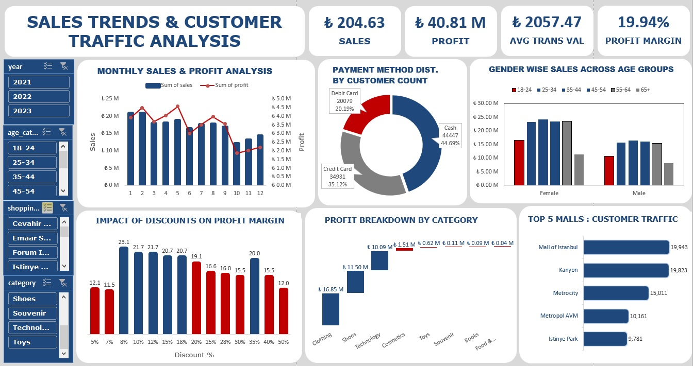

# Sales-Trends-And-Customer-Traffic-Analysis-Using-Excel

## Problem Statement

Shopping malls in Istanbul face challenges in optimizing sales and profitability. This project leverages Excel to uncover actionable insights by analyzing sales data, customer demographics, category-wise performance, and payment preferences.

## Goal

The primary goal of this project is to perform a detailed analysis of sales and customer behavior across shopping malls in Istanbul to:

- Identify sales and profit trends across months, categories, and demographics.
- Evaluate the impact of discounts on sales and profitability.
- Highlight high-performing categories, malls, and demographic groups for targeted strategies.

## Dashboard

## Stakeholders

- **Mall Managers:** To monitor and improve overall sales performance.
- **Retail Partners:** To enhance category-specific strategies.
- **Marketing Teams:** To design targeted promotional campaigns.

## Tools/Skills Used

- **Data Cleaning & Transformation:** Preprocessing the data for analysis.
- **Interactive Slicers:** Providing filtering options for better insights.
- **Conditional Formatting:** Enhancing data visibility.
- **Pivot Tables & Pivot Charts:** Summarizing and visualizing data.
- **Dashboard Design:** Creating an interactive and user-friendly dashboard.

## Key Insights

### 1. Monthly Trends
- **Highest Sales:** January (₺20.91M)
- **Lowest Sales:** October (₺12.04M)
- **Highest Profit:** May (₺4.56M)
- **Q1:** Strongest quarter for sales (₺59.61M)

### 2. Discount Analysis
- **Best Range:** 8%-18% discounts yielded the highest profits (~20%-23%).
- **Aggressive Discounts:** 25%-50% reduced profitability (~12%-16%).

### 3. Shopping Mall Performance
- **Top Performer:** Mall of Istanbul (19,943 customers).
- **Low Traffic:** Istinye Park (9,781 customers).

### 4. Customer Demographics
- **Gender:** Females contributed 60% of sales (₺122.23M), while males contributed ₺82.40M.
- **Age:** Customers aged 25-64 generated 75% of total sales.

### 5. Category Performance
- **Top Categories:** Clothing (₺16.85M profit), Shoes (₺11.50M profit), and Technology (₺10.09M profit).
- **Low Performers:** Souvenir, Books, and Food & Beverage (₺0.25M combined).

### 6. Payment Preferences
- **Cash:** Most preferred payment method (44,447 customers).
- **Credit Cards:** Second most preferred (34,931 customers).

## Conclusion

This Excel-based project delivers actionable insights for mall managers and retail partners, enabling them to fine-tune discount strategies, address category-specific challenges, and optimize customer engagement. The dashboard empowers stakeholders to make data-driven decisions, boosting overall profitability.

